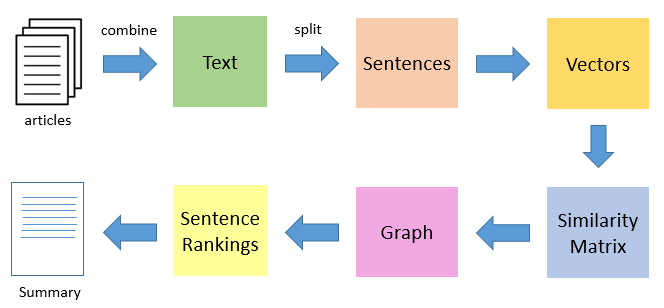
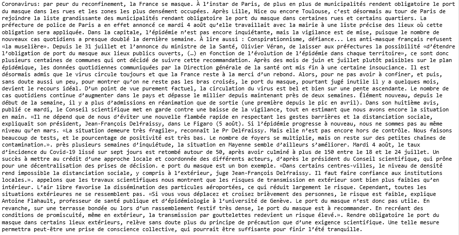

# Unsupervised-Text-Summarizer
This module summarizes any text using extractive summarization, an unsupervised technique.

## Description
The notebook takes any text file as input and summarizes it using extractive technique. Extractive summarizing methods identify the important sentences or phrases from the original text and extract only those from the text. Those extracted sentences form the summary.

In practice, sentences from the document are ranked against each other in terms of similarity. Using TextRank, top pages are then selected to generate the body of the summary, capturing most of the content of the original text file.

TextRank is an extractive and unsupervised text summarization technique:

The notebook manages French accentuated characters.

## How to use
- download and run the notebook
- place your text files into the same folder
- text files must be continuous (no back space).

## Results

input document :

Generated summary with 5 sentences target :

